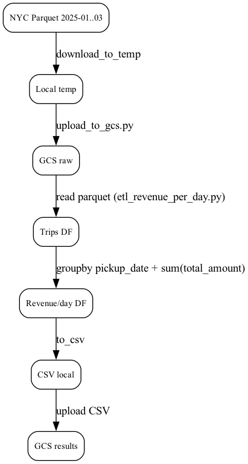

# NYC Green Taxi – Data Pipeline

In short: Load Green Taxi data (Jan–March 2025) into GCS, calculate **Revenue per Day**, and orchestrate everything with *Prefect* (locally).
>Source: https://www.nyc.gov/site/tlc/about/tlc-trip-record-data.page

---
## 1) Overview

- **Goal:** Raw → Process → Results (CSV) → (optional) BigQuery
- **Tech:** Python, Pandas, Google Cloud Storage, Prefect (local UI), (optional) BigQuery

### Dataflow
```text
flowchart LR
  A[NYC Green Taxi Parquet 2025-01..03] -->|download_to_temp| B[(Local temp)]
  B -->|upload_to_gcs.py| C[gs://nyc-taxi-pipeline-bucket/raw/]
  C -->|etl_revenue_per_day.py (read from GCS)| D[DataFrame: trips]
  D -->|groupby pickup_date + sum(total_amount)| E[DataFrame: revenue_per_day]
  E -->|to_csv| F[(revenue_per_day_2025.csv)]
  F -->|upload_to_gcs| G[gs://nyc-taxi-pipeline-bucket/results/revenue_per_day_2025.csv]
```

---

## 2) Repository Structure

```text
mle-data-pipeline-project/
├─ upload_to_gcs.py              # Download Jan–Mar 2025 & upload to GCS (raw/)
├─ etl_revenue_per_day.py        # Load from GCS, aggregate revenue/day, CSV + upload (results/)
├─ pipeline_prefect.py           # Prefect flow (upload_task -> etl_task)
├─ requirements.txt              # Python deps
├─ prefect.yaml                  # (optional) Prefect project file
├─ README.md                     # This file
├─ revenue_per_day_2025.csv      # (local) generated CSV (also uploaded to GCS)
├─ step-by-step-history.md       # (optional) history / notes
├─ data-pipeline-project.md      # (optional) brief project spec
└─ docs/
   └─ dataflow.png               # exported Mermaid/Graphviz
```

---

## 3) Prerequisites

* Python 3.11+
* Google Cloud SDK (`gcloud`, `gsutil`)
* GCP permission setup (Application Default Credentials)
* Google Cloud Storage (GCS) bucket (e.g. nyc-taxi-pipeline-bucket)

---

## 4) Setup (Local)

```bash
# clone & env
git clone https://github.com/<USER>/mle-data-pipeline-project.git
cd mle-data-pipeline-project
python -m venv .venv
source .venv/bin/activate
pip install -r requirements.txt

# GCP auth
gcloud auth application-default login
gcloud auth application-default set-quota-project <PROJECT_ID>

# env var for bucket
export GCS_BUCKET=nyc-taxi-pipeline-bucket
```

---

## 5) Run the Pipeline

### 5.1 Prefect (local UI)

```bash
# Terminal 1 – start UI
prefect server start
# UI: http://127.0.0.1:4200

# Terminal 2 – start worker
prefect worker start --pool "default-agent-pool"

# Terminal 3 – deploy & run
prefect deploy pipeline_prefect.py:main_flow \
  --name "nyc-taxi-flow" \
  --pool "default-agent-pool"
# choose "Interval" schedule in the wizard (e.g., 3600s) and activate

prefect deployment run "main-flow/nyc-taxi-flow"
```

###Project Status (Concise)

| #  | What                              | Why (very short)           | Where (platform)                                             | Command(s)                                                                                                                                                                            |
| -- | --------------------------------- | -------------------------- | ------------------------------------------------------------ | ------------------------------------------------------------------------------------------------------------------------------------------------------------------------------------- |
| 1  | Initialize repo & push            | Versioning & submission    | Local → GitHub                                               | `bash\ngit init\ngit remote add origin https://github.com/<USER>/mle-data-pipeline-project.git\ngit add .\ngit commit -m "init"\ngit branch -M main\ngit push -u origin main\n`       |
| 2  | Create Python venv & install deps | Reproducible runtime       | Local                                                        | `bash\npython -m venv .venv\nsource .venv/bin/activate\npip install -r requirements.txt\n`                                                                                            |
| 3  | GCP ADC login & set quota project | GCS access with billing    | Local ↔ Google Cloud                                         | `bash\ngcloud auth application-default login\ngcloud auth application-default set-quota-project <PROJECT_ID>\n`                                                                       |
| 4  | Create GCS bucket                 | Central data lake          | Google Cloud Storage                                         | `bash\ngsutil mb -p <PROJECT_ID> -l <REGION> gs://nyc-taxi-pipeline-bucket/\n`                                                                                                        |
| 5  | Upload Jan–Mar 2025 raw data      | Raw layer for processing   | Local → GCS                                                  | `bash\npython upload_to_gcs.py\n`                                                                                                                                                     |
| 6  | Set bucket env var                | Consistent config          | Local shell                                                  | `bash\nexport GCS_BUCKET=nyc-taxi-pipeline-bucket\n`                                                                                                                                  |
| 7  | Start Prefect server (UI)         | Orchestration & monitoring | Local (UI at [http://127.0.0.1:4200](http://127.0.0.1:4200)) | `bash\nprefect server start\n`                                                                                                                                                        |
| 8  | Start Prefect worker              | Execute flow runs          | Local                                                        | `bash\nprefect worker start --pool \"default-agent-pool\"\n`                                                                                                                          |
| 9  | Deploy flow (with schedule)       | Register & schedule runs   | Local (against local server)                                 | `bash\nprefect deploy pipeline_prefect.py:main_flow \\\n  --name \"nyc-taxi-flow\" \\\n  --pool \"default-agent-pool\"\n# choose Interval in the wizard (e.g., 3600s) and activate\n` |
| 10 | Trigger ad-hoc run                | Validate end-to-end        | Local (UI + logs)                                            | `bash\nprefect deployment run \"main-flow/nyc-taxi-flow\"\n`                                                                                                                          |
| 11 | Write ETL CSV to GCS              | Share analytics output     | Local → GCS                                                  | *(done inside flow)*                                                                                                                                                                  |
| 12 | Verify CSV in GCS                 | Confirm result exists      | Google Cloud Storage                                         | `bash\ngsutil stat \"gs://$GCS_BUCKET/results/revenue_per_day_2025.csv\"\n`                                                                                                           |

**Outputs now available:**

* Raw: `gs://nyc-taxi-pipeline-bucket/raw/green_tripdata_2025-01.parquet` (…02, …03)
* Result: `gs://nyc-taxi-pipeline-bucket/results/revenue_per_day_2025.csv`
---

## 6) Outputs

* **Raw (GCS):** `gs://$GCS_BUCKET/raw/green_tripdata_2025-01.parquet` (…02, …03)
* **Result CSV (GCS):** `gs://$GCS_BUCKET/results/revenue_per_day_2025.csv`

Check:

```bash
gsutil stat "gs://$GCS_BUCKET/results/revenue_per_day_2025.csv"
```

---

## 7) (Optional) Load CSV to BigQuery

Create dataset:

```bash
bq --location=EU mk --dataset YOUR_PROJECT:nyc_taxi_analytics
```

Load table:

```bash
bq --location=EU load \
  --source_format=CSV \
  --skip_leading_rows=1 \
  --time_partitioning_field=pickup_date \
  --clustering_fields=pickup_date \
  nyc_taxi_analytics.revenue_per_day_2025 \
  gs://$GCS_BUCKET/results/revenue_per_day_2025.csv \
  pickup_date:DATE,revenue:NUMERIC
```

Sample query:

```sql
SELECT pickup_date, revenue
FROM `YOUR_PROJECT.nyc_taxi_analytics.revenue_per_day_2025`
ORDER BY pickup_date
LIMIT 20;
```

---

## 8) Q&A (Submission)

**Steps taken (short):**

1. Init repo & venv; install deps
2. GCP ADC login; create/choose GCS bucket
3. Upload Jan–Mar 2025 Parquet → `raw/`
4. ETL: aggregate revenue/day; CSV → `results/`
5. Prefect local: server, worker, deploy, schedule, run
6. (Optional) Load CSV to BigQuery

**Challenges faced (short):**

* Orchestration choices; kept Prefect **local** for reproducibility and no cloud limits
* Data schema variations handled (datetime parse, numeric cast)

**What I’d do with more time:**

* Load into **BigQuery** instead of CSV (ELT), add **dbt** models & tests
* CI/CD (pre-commit, lint, type check), data quality checks, alerts

---

## 9) License

MIT (see `LICENSE`).


